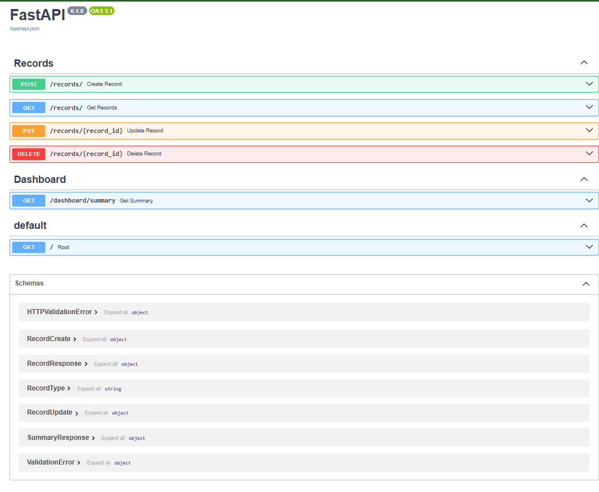

# Finance Data Processing and Access Control Backend

## Overview

This project is a backend system for a finance dashboard that manages financial records, user roles, and summary analytics. It is built using FastAPI and focuses on clean architecture, role-based access control, and structured data processing.

The system allows users to interact with financial data based on their roles while ensuring proper data isolation and access control.


## Features

### User Management

* Create and manage users
* Role assignment: **viewer, analyst, admin**
* User status handling (active / inactive)

### Role-Based Access Control (RBAC)

* Implemented using FastAPI dependencies
* Access rules:

  * **Viewer** → view-only access
  * **Analyst** → view records + dashboard insights
  * **Admin** → full access (create, update, delete)

### Financial Records

* Create, update, delete, and view records
* Each record includes:

  * amount
  * type (income / expense)
  * category
  * date
  * notes
* Records are tied to users (data isolation)

### Filtering Support

* Filter records using query parameters:

  * type
  * category
  * start_date
  * end_date

### Dashboard APIs

* Total income
* Total expenses
* Net balance
* Aggregation handled at database level

---

## Tech Stack

* FastAPI
* SQLAlchemy
* SQLite
* Pydantic

---

## Project Structure

```
app/
 ├── core/         # security and dependencies
 ├── models/       # database models
 ├── schemas/      # validation (Pydantic)
 ├── routes/       # API endpoints
 ├── services/     # business logic
```

---

## Setup Instructions

### 1. Clone repository

```
git clone <your-repo-link>
cd <project-folder>
```

### 2. Create virtual environment

```
python -m venv venv
venv\Scripts\activate
```

### 3. Install dependencies

```
pip install -r requirements.txt
```

### 4. Run the server

```
uvicorn app.main:app --reload
```

### 5. Open API docs

```
http://127.0.0.1:8000/docs
```

---

## API Overview

### Records

* `POST /records` → Create record (Admin)
* `GET /records` → Fetch records (with filters)
* `PUT /records/{id}` → Update record
* `DELETE /records/{id}` → Delete record

### Dashboard

* `GET /dashboard/summary` → Summary (Analyst/Admin)

---

## Assumptions

* Authentication is **mocked** for simplicity
* Current user is simulated via backend logic
* Each user can only access their own records

---

## Limitations

* No JWT authentication implemented
* Passwords are not hashed (can be added)
* No pagination for record listing

---

## Future Improvements

* JWT-based authentication
* Password hashing (bcrypt)
* Pagination and sorting
* Advanced analytics (monthly trends)
* Deployment (Docker / Cloud)

---

## Conclusion

This project demonstrates backend design principles including clean architecture, role-based access control, data validation, and aggregation logic. The focus was on building a maintainable and logically structured system rather than unnecessary complexity.

## API Preview

Below is a preview of the Swagger UI for interacting with the API:


